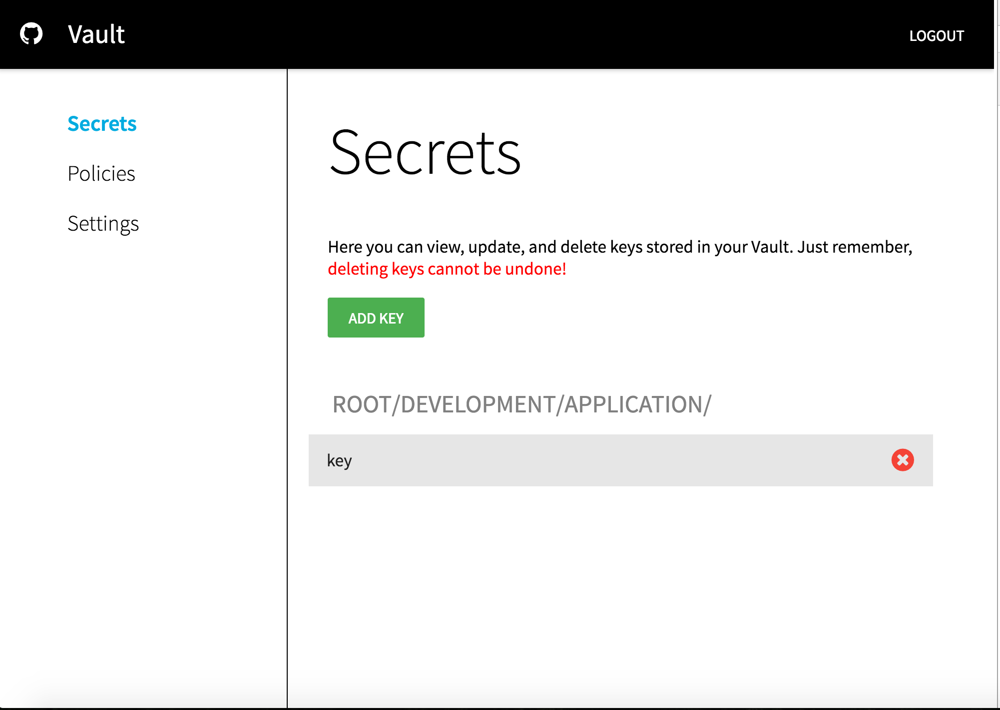
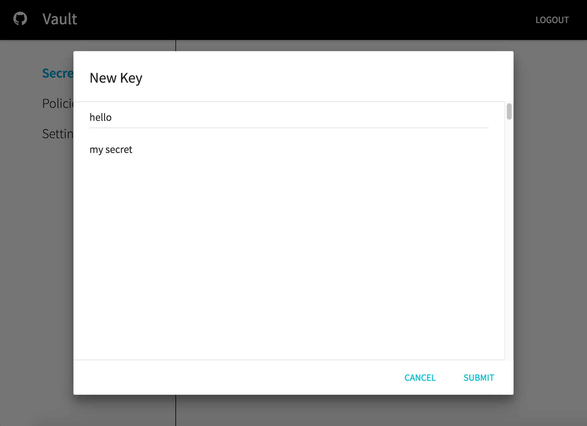
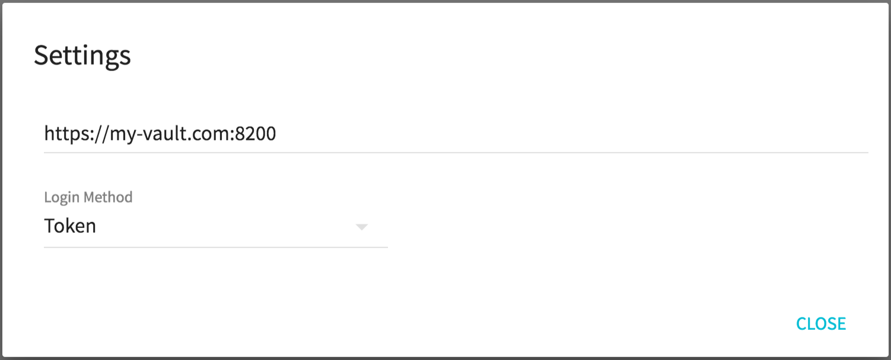
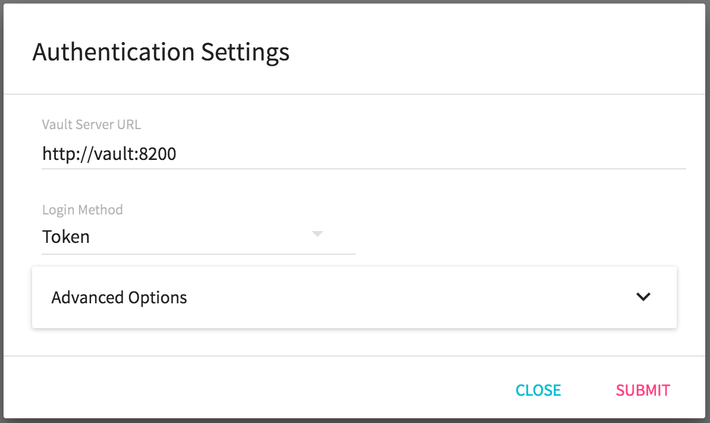
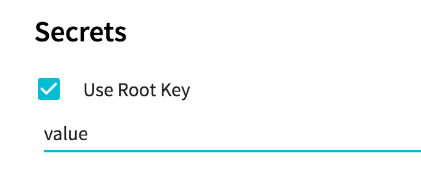

# Vault-UI
[](https://microbadger.com/images/djenriquez/vault-ui)
[](https://app.shippable.com/projects/581e7826fbc68c0f00deb0ca)

A beautiful way to manage your secrets in Vault





# Configuration
Configuration is accessed by clicking on the configuration cog on the login page.

## Vault Endpoint
Users can enter in the full endpoint to Vault, including scheme.
## Authentication
There are currently three supported authentication backends. [Github](https://www.vaultproject.io/docs/auth/github.html), [Username and Password](https://www.vaultproject.io/docs/auth/userpass.html), and [Token](https://www.vaultproject.io/docs/auth/token.html). 


## Secrets
By default, secrets will display as their raw JSON value represented by the `data` field in the HTTP GET response metadata. However, users can apply a "Root Key" bias to the secrets through the settings page. The "Root Key" will be used when reading, creating and updating secrets such that the value displayed in the UI is the value stored at the "Root Key". For example, if the secret at `secret/hello` is `{ "value": "world" }`, applying the "Root Key" `value` will update the UI such that the secret will display as simply "world" instead of `{ "value": "world" }`.

## Policies
Policies can be entered in as JSON or as HCL. If entered in as HCL, it will be converted to JSON as required for the PUT command in Vault's API. However, existing policies that are in HCL will continue to be displayed in HCL.

## Run
Vault-UI is attached to an automated build on Docker Hub. To run Vault-UI:
```bash
docker run -d \
-p 8000:8000 \
--name vault-ui \
djenriquez/vault-ui
```

## Development
```sh
npm install

# If you do not have webpack installed globally
npm install -g webpack

npm start
webpack -w
```

# Licensing
Vault-UI is licensed under BSD 2-Clause. See [LICENSE](https://github.com/djenriquez/vault-ui/blob/master/LICENSE) for the full license text.
